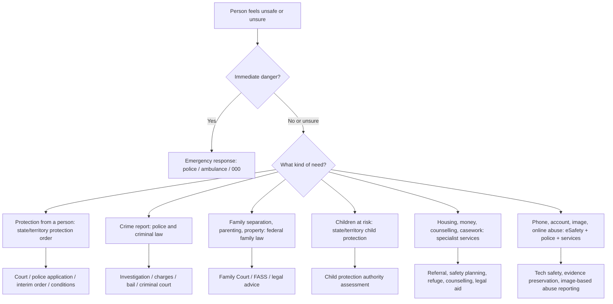
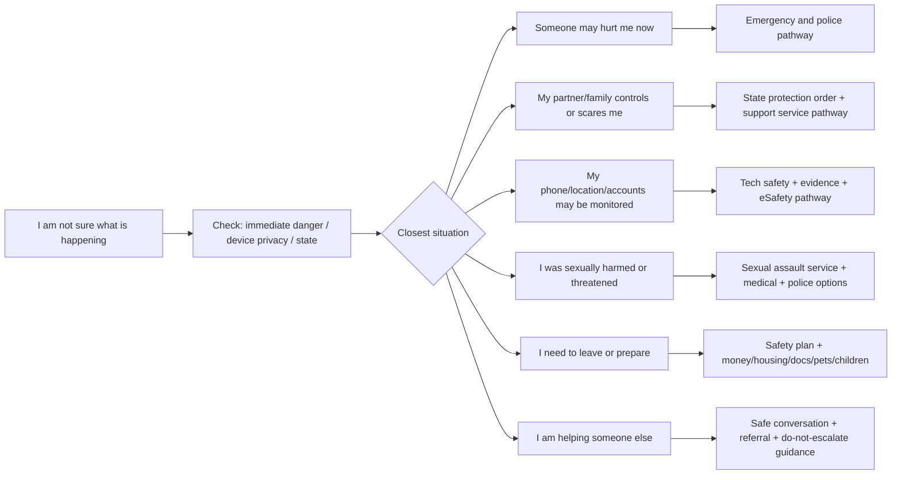

# Australia State Violence System Map

Last updated: 2026-07-13

This document maps Australia's federal, state, and territory systems for domestic, family, sexual, relationship, and technology-facilitated violence. It is a research map, not legal advice.

中文说明：这份文档的目的不是给法律建议，而是帮助我们理解澳大利亚各州和政府系统如何定义、处理和转介不同类型的暴力问题，然后再决定 Beacon 应该做什么数据分析和产品功能。

## 1. Why This Comes Before Product Features

Beacon should not begin by asking:

> Should we keep Chat, Risk Check, Resources, and Safety Plan?

The better research question is:

> When a person in Australia feels unsafe, which government or service system are they actually entering, and where does that system become confusing, slow, intimidating, culturally inaccessible, or hard to navigate?

Only after mapping the system should we design features.

## 2. The Australian Response System In One View

Australia does not have one single anti-violence system. It has overlapping systems:

Product implication:

Beacon should act as a first-step router. It should not pretend that one generic answer works for all states, all violence types, or all relationship situations.

## 3. Federal Layer

| Layer | What it covers | Why it matters for Beacon |
|---|---|---|
| Family Law Act 1975 | Parenting, separation, family law disputes, family violence relevance in family law matters | Users with children, separation, custody, property, or court questions may be in the federal family law system, not only state police/court systems. |
| National Domestic Violence Order Scheme | DVOs made from 2017-11-25 are automatically recognised and enforceable across Australia | Users who move between states need to know protection orders can travel nationally. |
| 1800RESPECT and national services | National counselling, information and referral pathways | Useful as national fallback, but not a replacement for state-specific navigation. |
| eSafety Commissioner | Online abuse, image-based abuse, technology-facilitated abuse resources and reporting | Crucial for phone monitoring, spyware, intimate image threats, GPS tracking, online harassment. |
| National Plan to End Violence against Women and Children 2022-2032 | National policy framework | Gives policy context, but does not tell an individual user exactly what to do first. |

Key federal finding:

National policy creates coordination, but police, protection orders, courts, child protection, and most frontline services are still state/territory specific.

## 4. State and Territory Law and System Map

This table gives a product research overview. Each jurisdiction needs deeper verification before building legal-facing content.

| Jurisdiction | Main protection-order law / framework | Common order name | Coercive control status | Service/system features to research | Beacon implication |
|---|---|---|---|---|---|
| ACT | Family Violence Act 2016; Personal Violence Act 2016 | Family Violence Order; Personal Protection Order | No standalone coercive-control criminal offence found in this first pass | ACT Magistrates Court family violence/protection order pathway; Domestic Violence Crisis Service; translated factsheets | Ask whether harm is family/partner related or personal/workplace related. |
| NSW | Crimes (Domestic and Personal Violence) Act 2007; Crimes Act 1900 coercive control offence | ADVO and APVO | Criminal offence from 2024-07-01 for current/former intimate partners | Strong public education around coercive control; local court AVO pathway; multilingual court site | NSW users need coercive-control explanation and evidence/timeline support, but only for behaviour after 2024-07-01 in criminal context. |
| NT | Domestic and Family Violence Act 2007 | Domestic Violence Order | No standalone coercive-control criminal offence found in this first pass | DVO can restrict contact, violence, property damage, threats, stalking/harassment, economic pressure | NT has high family violence context and different remote/community access issues; product must not assume metro service access. |
| QLD | Domestic and Family Violence Protection Act 2012; Criminal Law coercive-control reforms | Domestic Violence Order; Police Protection Notice | Criminal offence from 2025-05-26; applies to current/former intimate partner, family member, or informal unpaid carer; max penalty 14 years | Broad coercive-control education; local services finder; safety planning, evidence, children, legal advice, tech safety | QLD needs a very clear coercive-control pathway and broader relationship-type selection than NSW. |
| SA | Intervention Orders (Prevention of Abuse) Act 2009 | Intervention Order | Reform direction requires monitoring; no confirmed standalone offence in this first pass | Family Violence Court / domestic violence prevention programs; SA Royal Commission reforms to monitor | Beacon should mark SA as reform-sensitive and avoid overclaiming. |
| TAS | Family Violence Act 2004; Safe at Home framework | Family Violence Order; Police Family Violence Order | No standalone coercive-control offence found in this first pass, but emotional/economic abuse is central to the family violence framework | Integrated criminal justice style response; police powers and Safe at Home model | Tasmania is useful for studying integrated response design. |
| VIC | Family Violence Protection Act 2008; MARAM; FVISS/CISS; The Orange Door | Family Violence Intervention Order; Family Violence Safety Notice | No standalone coercive-control criminal offence found in this first pass; coercive/controlling patterns are embedded in family violence understanding | Most mature integrated service model: The Orange Door, MARAM risk framework, information sharing | Victoria is the best benchmark for service integration and risk assessment design. |
| WA | Restraining Orders Act 1997 | Family Violence Restraining Order; Violence Restraining Order | No standalone coercive-control criminal offence found in this first pass | Magistrates Court restraining order pathway; FDV strategy and service referral network | WA needs separation between family violence restraining orders and other restraining orders. |

## 5. Violence Definitions To Track Across Jurisdictions

For product research, do not only track "physical violence." The official and service systems increasingly recognise multiple abuse types:

| Violence / abuse type | Why it matters for Beacon |
|---|---|
| Physical violence | Often the clearest emergency/criminal pathway. |
| Sexual violence | May involve police, hospital/forensic options, counselling, legal support, and dating-app related pathways. |
| Emotional and psychological abuse | Often where users are unsure whether "this counts." |
| Coercive control | Central to modern law reform; NSW and QLD now have criminal offences, but scope differs. |
| Financial/economic abuse | Important for migration, dependence, housing, leaving preparation, and evidence gathering. |
| Social isolation | Often invisible but a major first-step trigger. |
| Technology-facilitated abuse | Phone checking, GPS tracking, spyware, shared accounts, image threats, online harassment. |
| Systems abuse | Threatening immigration, police, Centrelink, courts, child protection, or legal systems. |
| Reproductive abuse | Often under-recognised; relevant for health and safety referrals. |
| Child exposure to family violence | Triggers child protection and parenting-law complexity. |
| Elder abuse / carer abuse | May sit outside intimate partner framing; important for QLD and broader family/carer definitions. |

## 6. User Pathway Map For A Public-Facing Product

This is the kind of chart Beacon should eventually show people, but in safer, simpler language:

## 7. What This Means For Data Analysis

After the system map, data analysis should answer three layers:

### Layer A: Problem scale

Use ABS Personal Safety Survey and AIHW data.

Questions:

- How common are physical violence, sexual violence, intimate partner violence, family violence, stalking, sexual harassment, emotional abuse, and economic abuse?
- How do rates differ by gender?
- How do rates differ by state/territory?
- Which indicators are stable, rising, falling, or not comparable across time?

Output:

- national prevalence chart
- state/territory comparison chart
- trend chart
- violence type comparison table

### Layer B: System complexity

Use official government, court, police, legal aid, and service websites.

Questions:

- What is the protection order called in each state?
- Can police issue temporary notices?
- What happens after a report or application?
- Is coercive control a criminal offence in that jurisdiction?
- Does the page explain technology abuse, evidence, immigration, children, or interpreters?
- Is simplified/traditional Chinese available?

Output:

- jurisdiction comparison table
- service-pathway flowchart
- "confusing points" list

### Layer C: Product opportunity

Use interviews, usability tests, and service audit.

Questions:

- Where do users get stuck before contacting formal services?
- Do users understand whether their experience counts as abuse?
- Do users know which state system applies?
- Do users worry about phone monitoring or browser history?
- Do Chinese/CALD users understand legal/service terms?
- Do users want information, a checklist, a script, human referral, or anonymous story examples?

Output:

- first-click motivation map
- top user questions by segment
- feature opportunity ranking

## 8. Suggested Research Outputs

Build these in order:

1. Australia anti-violence system map
2. State/territory law and order-name matrix
3. Coercive-control law comparison
4. Official service pathway audit
5. Chinese/CALD service accessibility audit
6. ABS/AIHW prevalence dashboard
7. User motivation interview synthesis
8. Product direction scorecard

## 9. Product Hypothesis After This Mapping

Beacon should probably not be:

> a generic anti-violence encyclopedia.

It should more likely be:

> a state-aware first-step safety navigator that explains, in plain bilingual language, what kind of system the user may need and what their safest next step could be.

The core product question becomes:

> Can Beacon reduce the confusion between emergency help, protection orders, police, legal aid, family law, child protection, tech safety, and specialist services in the first 30 seconds?

## 10. Source List For Verification

Official / government sources checked in this pass:

- Attorney-General's Department, National Domestic Violence Order Scheme: https://www.ag.gov.au/families-and-marriage/family-violence/national-domestic-violence-order-scheme
- AIHW, Legal systems: https://www.aihw.gov.au/family-domestic-and-sexual-violence/responses-and-outcomes/legal-systems
- Family Violence Law Help, what is domestic and family violence: https://familyviolencelaw.gov.au/domestic-family-violence/what-is-domestic-and-family-violence/
- NSW Government, coercive control and the law: https://www.nsw.gov.au/family-and-relationships/coercive-control/law
- Queensland Government, coercive control laws: https://www.qld.gov.au/community/getting-support-health-social-issue/support-victims-abuse/need-to-know/coercive-control/coercive-control-laws
- ACT Magistrates Court, family violence and protection orders: https://www.courts.act.gov.au/magistrates/law-and-practice/family-violence-and-protection-orders/national-recognition-of-dvo
- NSW Local Court, Apprehended Violence Orders: https://localcourt.nsw.gov.au/about-us/jurisdictions0/apprehended-violence-orders.html
- NT Government, domestic violence orders: https://nt.gov.au/law/courts-and-tribunals/domestic-violence-orders
- Queensland Courts, domestic violence order information entry point: https://www.courts.qld.gov.au/
- South Australia Courts, family violence court and domestic violence prevention programs: https://www.courts.sa.gov.au/going-to-court/court-locations/adelaide-magistrates-court-2/court-intervention-programs/family-violence-court-and-domestic-violence-prevention-programs/
- Tasmania Department of Justice, National Domestic Violence Order Scheme: https://www.justice.tas.gov.au/national-domestic-violence-order-scheme
- Magistrates Court of Victoria, interstate intervention orders: https://www.mcv.vic.gov.au/intervention-orders/family-violence-intervention-orders/interstate-intervention-orders-fvio
- Victoria Government, The Orange Door service model: https://www.vic.gov.au/orange-door-service-model
- Western Australia Magistrates Court, restraining orders: https://www.magistratescourt.wa.gov.au/R/restraining_orders.aspx

## 11. Next Verification Tasks

Before using this in a public product, verify:

- exact current Act names and section references for each jurisdiction
- current coercive-control criminal law status in SA, TAS, VIC, WA, ACT, and NT
- current police-issued temporary notice powers by state
- current Chinese-language service availability by state
- whether each official page has translated content or only machine translation
- what each jurisdiction calls the protected person, respondent, applicant, and order conditions
- whether users can apply online, by police, at court, or through support services
