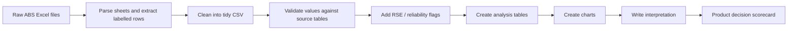

# How To Do Research And Data Analysis For Beacon

Last updated: 2026-07-13

中文说明：这份文档不是为了把你变成统计学家，而是帮你学会如何用“人话 + 数据 + 研究方法”判断 Beacon 应该做什么。

## 1. First: What I Actually Did With The Current Excel

我先如实说明：上一份 `beacon_abs_pss_research_dashboard.xlsx` 不是一个完整自动化、严谨到论文级别的数据科学 pipeline。

它的真实做法是：

1. 我读取了你给的 ABS Personal Safety Survey Excel 文件。
2. 我查看了每个 sheet 的结构，比如：
   - `Table 1.3`
   - `Table 2.3`
   - `Table 3.1`
   - `Table 9.3`
3. 我确认哪些行列对应关键指标。
4. 我把关键数字抽出来，整理成几个研究表：
   - 全国问题规模
   - 性别差异
   - 女性按州/领地差异
   - 12-month 趋势
   - 产品方向评分
5. 我用这些整理后的数字生成了一份 Excel 仪表盘和图表。

所以它目前是：

> desk research + selected data extraction + product reasoning dashboard

它还不是：

> full reproducible data pipeline + statistical modelling + peer-reviewed analysis

### What Is Good About It

它适合做第一轮产品研究，因为它能帮助我们回答：

- 这个问题在澳洲是不是足够大？
- 哪些暴力类型值得关注？
- 州/领地差异是否重要？
- Beacon 是否应该做 state-aware navigation？
- 哪些产品方向有数据支持，哪些没有？

### What Is Weak About It

它的弱点也要诚实承认：

- 数字是从 ABS 表里精选出来的，不是全量自动清洗。
- 产品方向评分是 research judgement，不是数学模型。
- 没有做显著性检验。
- 没有把 RSE / 置信区间系统纳入图表。
- 没有直接分析 Chinese/CALD、国际学生、dating app、手机监控，因为 ABS 这份数据本身不能直接回答这些问题。

下一步如果要更严谨，我们要把它升级成：

> raw data -> cleaning -> tidy dataset -> analysis table -> chart -> interpretation -> product decision

## 2. Data Analysis Is Not One Thing

很多人以为“数据分析”就是做图，其实不是。

在产品研究里，数据分析通常分几类。

## 3. Big Categories Of Research And Data Analysis

### 3.1 Descriptive Analysis

中文：描述性分析。

它回答：

> 发生了什么？规模多大？谁更多？哪里更多？

Example for Beacon:

- 澳洲有多少人经历过 physical violence？
- 女性和男性在 sexual violence 上差异多大？
- 哪些州的 intimate partner/family violence 更高？

Methods:

- percentages
- counts
- averages
- ranking
- bar charts
- line charts
- state comparison tables

Why use it:

这是所有研究的第一步。你不能一开始就问“做什么功能”，你要先知道问题长什么样。

### 3.2 Comparative Analysis

中文：比较分析。

它回答：

> A 和 B 有什么不同？

Example for Beacon:

- NSW 和 QLD 的 coercive control 法律有什么不同？
- Victoria 的服务体系和 WA 有什么不同？
- 华人用户和英语母语用户在求助路径上可能有什么不同？

Methods:

- comparison table
- matrix
- gap analysis
- before/after comparison
- jurisdiction map

Why use it:

Beacon 很可能不能做一个全国统一答案，因为澳洲各州的法律、保护令、服务系统不一样。

### 3.3 Trend Analysis

中文：趋势分析。

它回答：

> 这个问题是在上升、下降，还是相对稳定？

Example for Beacon:

- 女性 physical violence 的 12-month prevalence 从 1996 到 2021-22 如何变化？
- sexual harassment 在 2016 到 2021-22 是否下降？
- intimate partner violence 是否真的越来越严重，还是数据更复杂？

Methods:

- line chart
- time series table
- percentage-point change
- indexed trend

Important:

趋势分析最容易被误用。不要为了让产品显得重要，就说“所有东西都在上升”。如果数据没有这么说，就不能这么说。

Why use it:

趋势能帮助我们讲更诚实的故事。比如：

> 问题不一定每项都在上升，但用户依然需要更清楚、更安全、更低门槛的第一步支持。

### 3.4 Segmentation Analysis

中文：用户分群分析。

它回答：

> 不同人群的问题是不是不同？

Example for Beacon:

- 华人/CALD 用户是否有语言、文化、签证、家庭压力障碍？
- 国际学生是否更担心学校、签证、父母知道？
- dating app 用户是否更像“早期关系安全”问题，而不是传统家庭暴力问题？
- 被手机监控的人是否需要完全不同的隐私流程？

Methods:

- user segments
- persona is not enough; use evidence-backed segment
- survey cross-tab
- interview coding
- service usage comparison

Why use it:

如果你不分群，产品会变成“什么都想帮，但谁也没帮明白”。

### 3.5 Gap Analysis

中文：缺口分析。

它回答：

> 现有系统已经做了什么？用户还卡在哪里？

Example for Beacon:

Family Violence Law Help 已经解释了：

- 什么是家庭暴力
- 什么是 protection order
- 去哪里找 legal help
- 各州资源在哪里

那 Beacon 不能重复做这些。

Beacon 要找的是：

- 用户不知道自己是不是遇到 abuse
- 用户不知道先点哪里
- 用户不知道联系机构之后会发生什么
- 用户担心手机被看
- 用户想要中文解释，而不只是机器翻译
- 用户害怕报警、签证、孩子、钱、住房后果

Methods:

- competitor/service audit
- user journey map
- first-click test
- task analysis
- content audit

Why use it:

Gap analysis 是产品机会的核心。不是“哪里有问题”就能做产品，而是“哪里有未被满足的问题”才值得做。

### 3.6 Qualitative Analysis

中文：质性分析。

它回答：

> 人为什么这样想？为什么这样做？他们害怕什么？他们用什么语言描述问题？

Example for Beacon:

用户可能不会说：

> I am experiencing coercive control.

他们可能会说：

> 他总是看我的手机。
> 我不知道这算不算家暴。
> 我怕报警后签证出问题。
> 我怕我妈知道。
> 我只是想先知道下一步是什么。

Methods:

- interviews
- support worker conversations
- diary study
- open-ended survey
- thematic coding
- affinity mapping

Why use it:

很多“登陆网站的动机”不是 ABS 这种大数据能告诉你的。必须通过访谈、观察、开放问题获得。

### 3.7 Risk And Safety Analysis

中文：风险与安全分析。

它回答：

> 这个产品功能会不会伤害用户？

Example for Beacon:

Public forum 看起来能让人交流，但风险很高：

- 身份暴露
- 施暴者监控
- 错误建议
- 截图传播
- 创伤触发
- 法律风险
- 审核成本

Methods:

- harm mapping
- threat modelling
- privacy review
- safety-by-design checklist
- expert review with support workers

Why use it:

反暴力产品不能只问“用户想不想要”，还要问“这样做会不会让用户更危险”。

## 4. How To Choose A Method

你可以用这个简单逻辑：

| Question type | Use this method |
|---|---|
| 问题有多大？ | Descriptive analysis |
| 哪个州/人群更严重？ | Comparative / segmentation analysis |
| 是否越来越严重？ | Trend analysis |
| 现有服务有没有覆盖？ | Gap analysis |
| 用户为什么打开网站？ | Qualitative interviews + survey |
| 功能会不会危险？ | Risk and safety analysis |
| 哪个方向最值得做？ | Evidence scorecard |

## 5. The Right Order For Beacon

不要从功能开始。

正确顺序是：

1. System map
   - 澳洲联邦、州、法律、保护令、服务路径
2. Problem scale
   - ABS / AIHW 数据说明问题多大
3. State differences
   - 各州差异说明为什么产品需要 state-aware
4. Service gap
   - 政府、服务网站已经做了什么，还有什么没解决
5. User motivation
   - 用户为什么会打开 Beacon，而不是直接打电话/报警/找律师
6. Segment choice
   - 华人/CALD、国际学生、dating app、tech abuse、bystander 哪个最值得先做
7. Prototype
   - 做最小功能验证
8. Usability and safety test
   - 看用户是否真的理解、安全、愿意用

## 6. How To Analyse A Specific Question

### Question 1: Should Beacon Be State-Aware?

Data:

- ABS state/territory prevalence
- state laws and protection order names
- state police/court/legal aid pathways

Method:

- comparative analysis
- jurisdiction matrix
- state prevalence chart

Why:

如果各州法律和服务路径不同，而用户又必须按州行动，那 Beacon 就必须先问 state/territory。

Possible conclusion:

> Yes. The product should ask for state/territory early, because legal names, protection orders, police/court pathways, and coercive-control law status differ.

### Question 2: Should Beacon Focus On Chinese/CALD Users?

Data:

- ANROWS CALD research
- eSafety CALD women research
- multicultural service directory
- Chinese-language service availability
- interviews with Chinese-speaking users or community workers

Method:

- gap analysis
- qualitative analysis
- service accessibility audit

Why:

ABS can prove the general problem scale, but not the specific Chinese-user need. We need CALD-specific evidence.

Possible conclusion:

> This direction is promising, but it needs extra data beyond ABS.

### Question 3: Should Beacon Build A Phone Monitoring / Tech Abuse Tool?

Data:

- eSafety tech-facilitated abuse research
- ANROWS / WESNET resources
- user interviews about phone/account/location concerns
- service worker interviews

Method:

- risk taxonomy
- journey map
- safety analysis

Why:

Tech abuse changes the product design itself: no login, quick exit, safe browsing, low data retention, discreet language.

Possible conclusion:

> Strong product fit if research confirms users search for phone/location/account monitoring before they search for domestic violence.

### Question 4: Should Beacon Have A Public Posting Forum?

Data:

- user desire for peer support
- safety risks
- moderation capacity
- expert review

Method:

- risk and safety analysis
- moderated concept testing

Why:

User demand alone is not enough. In this topic, a popular feature can still be unsafe.

Possible conclusion:

> Do not build public forum first. Test safer alternatives: reviewed anonymous stories, professional Q&A, moderated resource notes.

## 7. How To Use Tools

### Spreadsheet / Excel

Use when:

- you need tables
- you need charts
- you need to compare states
- you need to show source notes
- you need something a supervisor or stakeholder can open

For Beacon:

- ABS prevalence dashboard
- state comparison matrix
- product direction scorecard

### Markdown Docs

Use when:

- you need reasoning
- you need research notes
- you need definitions
- you need methodology
- you need to explain why decisions were made

For Beacon:

- system map
- method guide
- competitor audit notes
- interview synthesis

### Python / R / JS

Use when:

- raw data needs cleaning
- multiple files need merging
- you need reproducible analysis
- you need statistical testing
- you need larger charts or dashboards

For Beacon:

- parse ABS workbooks automatically
- create tidy CSV files
- calculate differences and rankings
- generate clean datasets for Excel

### Interviews

Use when:

- you need to understand motivation
- you need language people actually use
- you need to know what feels scary, confusing, or unsafe

For Beacon:

- support worker interviews first
- community worker interviews
- low-risk user interviews
- avoid interviewing people in immediate danger without safeguards

## 8. What A Proper Data Pipeline Would Look Like

The current workbook is a first research dashboard.

A more rigorous next version should be:

## 9. What We Should Do Next

Recommended next step:

> Upgrade the ABS workbook from selected manual extraction to a reproducible analysis dataset.

具体做法：

1. Create `data/processed/pss_key_metrics.csv`
2. Each row should have:
   - source file
   - source sheet
   - population
   - indicator
   - jurisdiction
   - gender
   - period
   - value
   - unit
   - reliability flag if available
3. Rebuild charts from that processed CSV.
4. Add a method note explaining exactly how each number was extracted.
5. Then connect it to service-system data.

## 10. The Main Lesson

Do not ask:

> What feature should I add?

Ask:

> What decision does the user need to make, what stops them, and what evidence proves this is the right problem to solve?

For Beacon, the research direction should be:

> Use official data to prove the problem landscape, use system mapping to prove complexity, use service audit to prove gaps, and use interviews to prove user motivation.

Only after that should we design the product.
