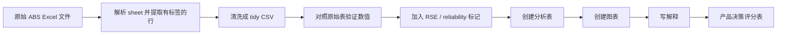

# 如何为 Beacon 做研究和数据分析

最后更新：2026-07-14

这份文档不是为了把你变成统计学家，而是帮你学会如何用“人话 + 数据 + 研究方法”判断 Beacon 应该做什么。

## 1. 先说清楚：目前那份 Excel 是怎么做出来的

上一份 `beacon_abs_pss_research_dashboard.xlsx` 不是一个完整自动化、严谨到论文级别的数据科学流程。

真实过程是：

1. 读取你给的 ABS Personal Safety Survey Excel 文件。
2. 查看每个 sheet 的结构，例如：
   - `Table 1.3`
   - `Table 2.3`
   - `Table 3.1`
   - `Table 9.3`
3. 确认哪些行列对应关键指标。
4. 把关键数字抽出来，整理成几个研究表：
   - 全国问题规模
   - 性别差异
   - 女性按州/领地差异
   - 12 个月趋势
   - 产品方向评分
5. 用这些整理后的数字生成 Excel 仪表盘和图表。

所以它目前是：

> 桌面研究 + 选择性数据抽取 + 产品判断仪表盘

它还不是：

> 完整可复现的数据流程 + 统计建模 + 论文级分析

### 它的价值

它适合做第一轮产品研究，因为它能帮助我们回答：

- 这个问题在澳洲是不是足够大？
- 哪些暴力类型值得关注？
- 州/领地差异是否重要？
- Beacon 是否应该做按州导航？
- 哪些产品方向有数据支持，哪些还缺证据？

### 它的不足

它的弱点也要诚实承认：

- 数字是从 ABS 表里精选出来的，不是全量自动清洗。
- 产品方向评分是研究判断，不是数学模型。
- 没有做显著性检验。
- 没有把 RSE / 置信区间系统纳入图表。
- 没有直接分析华人/CALD、国际学生、dating app、手机监控，因为 ABS 这份数据本身不能直接回答这些问题。

下一步如果要更严谨，我们要升级成：

> 原始数据 -> 清洗 -> tidy dataset -> 分析表 -> 图表 -> 解读 -> 产品决策

## 2. 数据分析不是一件事

很多人以为“数据分析”就是做图，其实不是。

在产品研究里，数据分析通常分成几类。

## 3. 研究和数据分析的大类

### 3.1 描述性分析

它回答：

> 发生了什么？规模多大？谁更多？哪里更多？

Beacon 例子：

- 澳洲有多少人经历过 physical violence？
- 女性和男性在 sexual violence 上差异多大？
- 哪些州的 intimate partner / family violence 更高？

常用方法：

- 百分比
- 人数
- 平均数
- 排名
- 柱状图
- 折线图
- 州/领地比较表

为什么用它：

这是所有研究的第一步。不能一开始就问“做什么功能”，要先知道问题长什么样。

### 3.2 比较分析

它回答：

> A 和 B 有什么不同？

Beacon 例子：

- NSW 和 QLD 的 coercive control 法律有什么不同？
- Victoria 的服务体系和 WA 有什么不同？
- 华人用户和英语母语用户在求助路径上可能有什么不同？

常用方法：

- 对比表
- 矩阵
- 缺口分析
- 前后对比
- 州/领地系统地图

为什么用它：

Beacon 很可能不能给一个全国统一答案，因为澳洲各州的法律、保护令和服务系统都不完全一样。

### 3.3 趋势分析

它回答：

> 这个问题是在上升、下降，还是相对稳定？

Beacon 例子：

- 女性 physical violence 的 12-month prevalence 从 1996 到 2021-22 如何变化？
- sexual harassment 在 2016 到 2021-22 是否下降？
- intimate partner violence 是否真的越来越严重，还是数据更复杂？

常用方法：

- 折线图
- 时间序列表
- 百分点变化
- 指数化趋势

重要提醒：

趋势分析最容易被误用。不要为了让产品显得重要，就说“所有东西都在上升”。如果数据没有这么说，就不能这么说。

为什么用它：

趋势能帮我们讲更诚实的故事。例如：

> 问题不一定每项都在上升，但用户依然需要更清楚、更安全、更低门槛的第一步支持。

### 3.4 用户分群分析

它回答：

> 不同人群的问题是不是不同？

Beacon 例子：

- 华人/CALD 用户是否有语言、文化、签证、家庭压力障碍？
- 国际学生是否更担心学校、签证、父母知道？
- dating app 用户是否更像“早期关系安全”问题，而不是传统家庭暴力问题？
- 被手机监控的人是否需要完全不同的隐私流程？

常用方法：

- 用户分群
- 有证据支撑的 persona
- survey cross-tab
- 访谈编码
- 服务使用比较

为什么用它：

如果不分群，产品会变成“什么都想帮，但谁也没帮明白”。

### 3.5 缺口分析

它回答：

> 现有系统已经做了什么？用户还卡在哪里？

Beacon 例子：

Family Violence Law Help 已经解释了：

- 什么是家庭暴力
- 什么是 protection order
- 去哪里找 legal help
- 各州资源在哪里

所以 Beacon 不能只是重复做这些。

Beacon 要找的是：

- 用户不知道自己是不是遇到 abuse
- 用户不知道先点哪里
- 用户不知道联系机构之后会发生什么
- 用户担心手机被看
- 用户想要中文解释，而不只是机器翻译
- 用户害怕报警、签证、孩子、钱、住房后果

常用方法：

- 竞品/服务审计
- 用户旅程图
- first-click test
- 任务分析
- 内容审计

为什么用它：

缺口分析是产品机会的核心。不是“哪里有问题”就能做产品，而是“哪里有未被满足的问题”才值得做。

### 3.6 质性分析

它回答：

> 人为什么这样想？为什么这样做？他们害怕什么？他们用什么语言描述问题？

Beacon 例子：

用户可能不会说：

> I am experiencing coercive control.

他们可能会说：

> 他总是看我的手机。  
> 我不知道这算不算家暴。  
> 我怕报警后签证出问题。  
> 我怕我妈知道。  
> 我只是想先知道下一步是什么。

常用方法：

- 访谈
- 和 support worker 交流
- diary study
- 开放式问卷
- 主题编码
- affinity mapping

为什么用它：

很多“用户为什么会打开网站”的动机，不是 ABS 这种大数据能告诉你的。必须通过访谈、观察、开放问题获得。

### 3.7 风险与安全分析

它回答：

> 这个产品功能会不会伤害用户？

Beacon 例子：

Public forum 看起来能让人交流，但风险很高：

- 身份暴露
- 施暴者监控
- 错误建议
- 截图传播
- 创伤触发
- 法律风险
- 审核成本

常用方法：

- harm mapping
- threat modelling
- 隐私审查
- safety-by-design checklist
- 和 support worker 做专家评审

为什么用它：

反暴力产品不能只问“用户想不想要”，还要问“这样做会不会让用户更危险”。

## 4. 如何选择方法

可以用这个简单逻辑：

| 你想问的问题 | 应该用的方法 |
|---|---|
| 问题有多大？ | 描述性分析 |
| 哪个州/人群更严重？ | 比较分析 / 分群分析 |
| 是否越来越严重？ | 趋势分析 |
| 现有服务有没有覆盖？ | 缺口分析 |
| 用户为什么打开网站？ | 质性访谈 + 问卷 |
| 功能会不会危险？ | 风险与安全分析 |
| 哪个方向最值得做？ | Evidence scorecard |

## 5. Beacon 的正确研究顺序

不要从功能开始。

正确顺序是：

1. System map  
   澳洲联邦、州、法律、保护令、服务路径。
2. Problem scale  
   用 ABS / AIHW 数据说明问题多大。
3. State differences  
   用各州差异说明为什么产品需要 state-aware。
4. Service gap  
   政府和服务网站已经做了什么，还有什么没解决。
5. User motivation  
   用户为什么会打开 Beacon，而不是直接打电话、报警、找律师。
6. Segment choice  
   华人/CALD、国际学生、dating app、tech abuse、bystander 哪个最值得先做。
7. Prototype  
   做最小功能验证。
8. Usability and safety test  
   看用户是否真的理解、安全、愿意用。

## 6. 如何分析具体问题

### 问题 1：Beacon 是否应该按州导航？

需要的数据：

- ABS 州/领地 prevalence
- 各州法律和保护令名称
- 各州 police / court / legal aid 路径

方法：

- 比较分析
- jurisdiction matrix
- 州 prevalence 图表

为什么：

如果各州法律和服务路径不同，而用户又必须按州行动，那 Beacon 就必须先问 state/territory。

可能结论：

> 是的。产品应该早期询问用户所在州/领地，因为法律名称、保护令、警察/法院路径和 coercive control 法律状态都不同。

### 问题 2：Beacon 是否应该聚焦华人/CALD 用户？

需要的数据：

- ANROWS CALD 研究
- eSafety CALD women 研究
- multicultural service directory
- 中文服务可获得性
- 华人用户或社区工作者访谈

方法：

- 缺口分析
- 质性分析
- 服务可及性审计

为什么：

ABS 能证明总体问题规模，但不能证明华人用户的具体需求。我们需要 CALD-specific evidence。

可能结论：

> 这个方向很有潜力，但需要 ABS 之外的数据支持。

### 问题 3：Beacon 是否应该做手机监控 / tech abuse 工具？

需要的数据：

- eSafety tech-facilitated abuse 研究
- ANROWS / WESNET 资料
- 用户关于手机、账号、定位担忧的访谈
- support worker 访谈

方法：

- 风险分类
- 用户旅程图
- 安全分析

为什么：

Tech abuse 会直接改变产品设计：不能强迫登录、要有 quick exit、要安全浏览、要低数据保留、语言要隐蔽。

可能结论：

> 如果研究确认用户会先搜索手机、定位、账号监控，而不是 domestic violence，这会是非常强的产品方向。

### 问题 4：Beacon 是否应该有公开发帖社区？

需要的数据：

- 用户是否需要 peer support
- 安全风险
- 审核能力
- 专家评审

方法：

- 风险与安全分析
- moderated concept testing

为什么：

用户说想要，不代表这个功能安全。在这个主题里，一个受欢迎的功能也可能伤害用户。

可能结论：

> 不要先做公开论坛。先测试更安全的替代品：审核后的匿名故事、专业 Q&A、按州的下一步导航。

## 7. 工具怎么用

### Excel / Spreadsheet

适合：

- 做表格
- 做图
- 比较各州
- 标注数据来源
- 做给导师、stakeholder 看得懂的东西

Beacon 用法：

- ABS prevalence dashboard
- 州比较矩阵
- 产品方向评分表

### Markdown 文档

适合：

- 写研究逻辑
- 写定义
- 写方法
- 写为什么这样决策
- 写访谈总结

Beacon 用法：

- system map
- 方法指南
- 竞品审计
- 访谈 synthesis

### Python / R / JS

适合：

- 清洗原始数据
- 合并多个文件
- 做可复现分析
- 做统计检验
- 做更大的图表或 dashboard

Beacon 用法：

- 自动解析 ABS workbook
- 生成 tidy CSV
- 计算差异和排名
- 给 Excel 提供干净数据

### 访谈

适合：

- 理解动机
- 理解用户真实语言
- 理解什么让人害怕、困惑、不安全

Beacon 用法：

- 先访谈 support worker
- 再访谈社区工作者
- 再做低风险用户访谈
- 不要在没有安全保护的情况下访谈正在处于即时危险的人

## 8. 更严谨的数据流程应该长什么样

目前 workbook 是第一版研究仪表盘。

更严谨的版本应该是：

## 9. 下一步应该做什么

推荐下一步：

> 把 ABS workbook 从“选择性手动提取”升级成“可复现分析数据集”。

具体做法：

1. 创建 `data/processed/pss_key_metrics.csv`
2. 每一行包含：
   - source file
   - source sheet
   - population
   - indicator
   - jurisdiction
   - gender / sex
   - period
   - value
   - unit
   - reliability flag
3. 从这个 CSV 重建图表。
4. 加一份 method note，说明每个数字怎么来的。
5. 再把它连接到服务系统数据。

## 10. 最重要的一课

不要问：

> 我要加什么功能？

要问：

> 用户需要做什么决定？是什么阻止了他们？什么证据证明这是值得解决的问题？

对 Beacon 来说，研究方向应该是：

> 用官方数据证明问题环境，用系统地图证明复杂性，用服务审计证明缺口，用访谈证明用户动机。

只有在这些之后，才应该设计产品。
